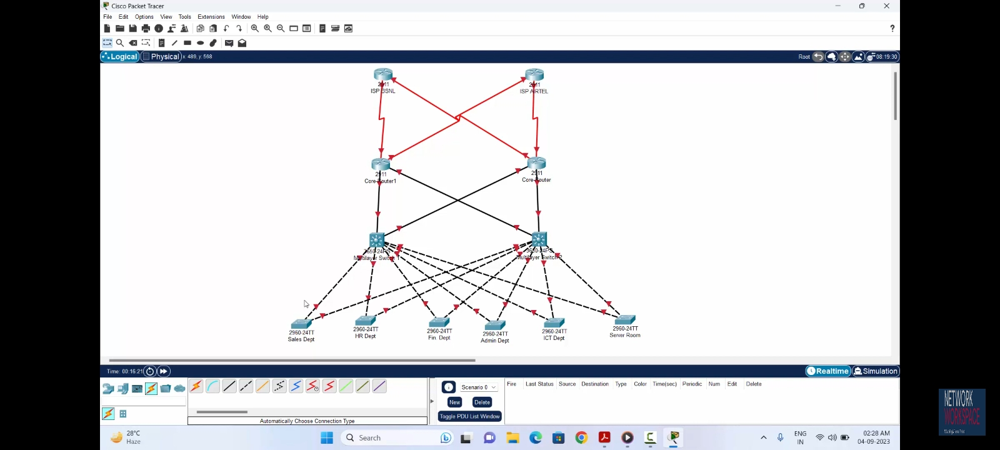
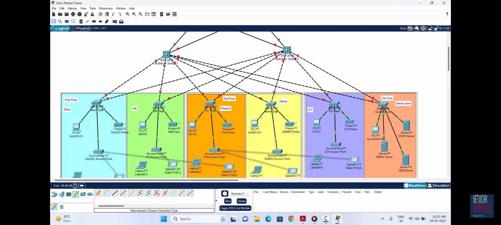
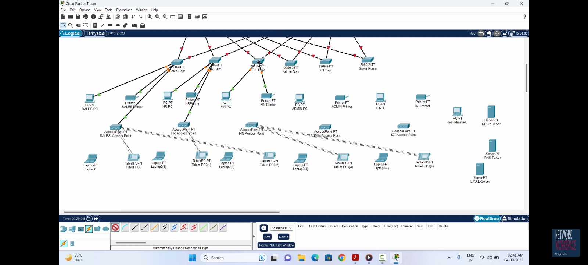

# Share Market Company – Enterprise Network Design with Redundancy (Cisco Packet Tracer)

A complete, hierarchical and **fully redundant** campus network designed and implemented in **Cisco Packet Tracer** for a trading floor support centre with **600 staff** moving into a brand-new 3-floor building.

> Video walkthrough (Hindi): *Share Market Company Network Design Project Using Cisco Packet Tracer in Hindi (Network Redundancy)*

---

## 📌 Project Scenario

A trading floor support centre (600 staff) is moving to a new building that has no network. A new network has to be designed and implemented before the move.

| Floor | Departments | Users / Devices |
|---|---|---|
| 1st | Sales & Marketing, HR & Logistics | 120 + 120 users |
| 2nd | Finance & Accounts, Administration & PR | 120 + 120 users |
| 3rd | ICT, Server Room | 120 users + 12 devices |

## ✅ Requirements

1. Design and implement using Cisco Packet Tracer
2. Hierarchical model with redundancy at every layer (2 routers + 2 multilayer switches)
3. Connect to at least 2 ISPs; each router connected to both ISPs
4. Wireless network for each department
5. Each department in its own VLAN and subnet
6. Subnetting from base network `172.16.1.0`
7. ISP links: `195.136.17.0/30`, `.4/30`, `.8/30`, `.12/30`
8. Basic device hardening (hostname, console/enable password, banner, disable DNS lookup)
9. Inter-VLAN routing on multilayer switches
10. IP addressing on multilayer switches
11. DHCP server in the server room for all devices
12. Static IPs for server room devices
13. OSPF on routers and multilayer switches
14. SSH on all routers and Layer 3 switches
15. Port security on Finance & Accounts (1 device per port, sticky MAC, shutdown violation)
16. PAT on outbound router interfaces with ACL
17. End-to-end communication testing

---

## 🗺️ Network Topology

### Overall Design (ISPs → Core Routers → Multilayer Switches → Access Switches)



*Two ISPs are cross-connected to two core routers. Each core router connects to both multilayer switches, and every access switch is dual-homed to both multilayer switches, so there is no single point of failure.*

### Department Layout (Floors, VLANs, Wireless and Servers)



*Each department has its own access switch, PC, printer and a wireless access point serving laptops and tablets. The server room hosts the DHCP, Email and DNS servers plus a sysadmin PC.*

### End Devices per Department



*Every department (Sales, HR, Finance, Admin, ICT) has a PC, a printer, an access point, a laptop and a tablet. The server room has the sysadmin PC and three servers.*

---

## 🏗️ Network Architecture

**Three-tier hierarchical model, no single point of failure:**

- **ISP layer:** 2 ISP routers (BSNL and Airtel, Cisco 2911)
- **Core / Edge layer:** 2 core routers (Cisco 2911), each connected to both ISPs via serial links
- **Distribution layer:** 2 multilayer switches (Cisco 3650-24PS: `MLT-SW1`, `MLT-SW2`)
- **Access layer:** 6 Cisco 2960-24TT switches, one per department, each dual-homed to both multilayer switches (`Fa0/1` and `Fa0/2` trunks)
- **End devices:** PCs, printers, laptops, tablets, wireless access points
- **Server room:** DHCP server, Email server, DNS server

### Device Naming

| Device | Hostname |
|---|---|
| Core routers | `Core-Router1`, `Core-Router2` |
| Multilayer switches | `MLT-SW1`, `MLT-SW2` |
| Access switches | `Sales-SW`, `HR-SW`, `Finance-SW`, `Admin-SW`, `ICT-SW`, `SERVER-SW` |

### VLAN Plan

| VLAN ID | Name | Department |
|---|---|---|
| 10 | Sales | Sales & Marketing |
| 20 | HR | HR & Logistics |
| 30 | Finance | Finance & Accounts |
| 40 | admin | Administration & PR |
| 50 | ICT | ICT |
| 60 | ServerRoom | Server Room |
| 99 | BlackHole | Unused ports (shutdown) |

---

## 📋 Implementation Roadmap

1. Basic settings on all devices + SSH on routers and multilayer switches
2. VLAN assignment, access and trunk ports on access and multilayer switches
3. Switchport security on the Finance department
4. Subnetting and IP addressing
5. OSPF on routers and multilayer switches
6. Static IPs for server room devices
7. DHCP server configuration
8. Inter-VLAN routing on multilayer switches + `ip helper-address`
9. Wireless network configuration
10. PAT + Access Control List
11. Verification and testing

---

## ⚙️ Step-by-Step Configuration

> **Note:** Passwords such as `cisco` are used only for this lab. In production, use strong unique passwords and AAA/TACACS+/RADIUS.

### Step 1: Basic Device Settings and SSH

#### 1.1 Basic hardening (all switches, example: `MLT-SW2`)

Sets a hostname, warning banner, disables DNS lookup, secures console and privileged mode, and encrypts plain-text passwords.

```
enable
configure terminal
hostname MLT-SW2
banner motd #No unauthorized Access#
no ip domain-lookup
line console 0
 password cisco
 login
 exit
enable password cisco
service password-encryption
do wr
exit
```

The same template is applied to every device with its own hostname (`Sales-SW`, `HR-SW`, `ICT-SW`, `SERVER-SW`, `MLT-SW1`, ...).

#### 1.2 Enable SSH (routers and multilayer switches, example: `MLT-SW1`)

```
configure terminal
ip domain-name cisco.net
username admin password cisco
crypto key generate rsa
! modulus: 1024
line vty 0 14
 login local
 transport input ssh
 exit
ip ssh version 2
do wr
```

**Why:** Telnet sends credentials in clear text. SSHv2 with local authentication encrypts remote management sessions.

#### 1.3 Bring up ISP-facing serial interfaces (`Core-Router1`)

```
enable
configure terminal
interface serial 0/2/0
 no shutdown
interface serial 0/2/1
 no shutdown
```

Each core router has two serial links, one to each ISP, giving ISP-level redundancy.

---

### Step 2: VLANs, Access Ports and Trunk Ports

#### 2.1 Access switch (example: `Sales-SW`, VLAN 10)

```
configure terminal
! Uplinks to both multilayer switches
interface range fa0/1-2
 switchport mode trunk
 exit

! Create VLAN
vlan 10
 name Sales
 exit

! User ports
interface range fa0/3-24
 switchport mode access
 switchport access vlan 10
 exit
do wr

! Security: park unused ports in a black-hole VLAN and shut them down
vlan 99
 name BlackHole
 exit
interface range gig0/1-2
 switchport mode access
 switchport access vlan 99
 shutdown
 exit
do wr
```

Same pattern for the other access switches, changing only the VLAN:

| Switch | VLAN ID | VLAN Name |
|---|---|---|
| `Sales-SW` | 10 | Sales |
| `HR-SW` | 20 | HR |
| `Finance-SW` | 30 | Finance |
| `Admin-SW` | 40 | admin |
| `ICT-SW` | 50 | ICT |
| `SERVER-SW` | 60 | ServerRoom |

#### 2.2 Multilayer switches (`MLT-SW1` and `MLT-SW2`)

Trunk ports towards the six access switches, and all VLANs created so both distribution switches carry the full VLAN database:

```
configure terminal
interface range gig1/0/3-8
 switchport mode trunk
 exit

vlan 10
 name Sales
vlan 20
 name HR
vlan 30
 name Finance
vlan 40
 name admin
vlan 50
 name ICT
vlan 60
 name ServerRoom
 exit
do wr
```

#### 🔧 Troubleshooting note

After connecting, the multilayer switch logged:

```
%SPANTREE-2-RECV_PVID_ERR: Received 802.1Q BPDU on non trunk GigabitEthernet1/0/8
%SPANTREE-2-BLOCK_PVID_LOCAL: Blocking GigabitEthernet1/0/8 on VLAN0001. Inconsistent port type.
```

**Cause:** the access switch side was a trunk, but the multilayer switch port was still in access mode (port type mismatch).
**Fix:** set `switchport mode trunk` on the multilayer switch ports (`gig1/0/3-8`) so both ends match, and the port left the blocking state.

---

### Step 3: Switchport Security (Finance Dept)
*Screenshots to be added.*

### Step 4: Subnetting and IP Addressing

**Base network:** `172.16.1.0`. VLSM is used so that every department gets exactly the address space it needs without waste.

#### 4.1 Department subnets

| Floor | Dept | VLAN | Network | Mask | Usable Host Range | Broadcast |
|---|---|---|---|---|---|---|
| 1st | Sales | 10 | 172.16.1.0 | /25 (255.255.255.128) | 172.16.1.1 – 172.16.1.126 | 172.16.1.127 |
| 1st | HR | 20 | 172.16.1.128 | /25 | 172.16.1.129 – 172.16.1.254 | 172.16.1.255 |
| 2nd | Finance | 30 | 172.16.2.0 | /25 | 172.16.2.1 – 172.16.2.126 | 172.16.2.127 |
| 2nd | Admin | 40 | 172.16.2.128 | /25 | 172.16.2.129 – 172.16.2.254 | 172.16.2.255 |
| 3rd | ICT | 50 | 172.16.3.0 | /25 | 172.16.3.1 – 172.16.3.126 | 172.16.3.127 |
| 3rd | Server Room | 60 | 172.16.3.128 | /28 (255.255.255.240) | 172.16.3.129 – 172.16.3.142 | 172.16.3.143 |

**Why:** a /25 gives 126 usable hosts, enough for 120 users per department. The server room needs only 12 devices, so a /28 (14 usable hosts) is used instead of wasting a full /25.

#### 4.2 Point-to-point links: Core routers ↔ Multilayer switches (/30)

Each /30 provides exactly 2 usable addresses, ideal for router-to-switch links. Every core router connects to both multilayer switches (full mesh) so no single link or device failure isolates the network.

| Link | Network | Router side | Multilayer switch side |
|---|---|---|---|
| Core-Router1 ↔ MLT-SW1 | 172.16.3.144/30 | Core-Router1 `Gi0/0` = 172.16.3.146 | MLT-SW1 `Gi1/0/1` = 172.16.3.145 |
| Core-Router2 ↔ MLT-SW1 | 172.16.3.148/30 | Core-Router2 `Gi0/0` = 172.16.3.150 | MLT-SW1 `Gi1/0/2` = 172.16.3.149 |
| Core-Router1 ↔ MLT-SW2 | 172.16.3.152/30 | Core-Router1 `Gi0/1` = 172.16.3.154 | MLT-SW2 `Gi1/0/1` = 172.16.3.153 |
| Core-Router2 ↔ MLT-SW2 | 172.16.3.156/30 | Core-Router2 `Gi0/1` = 172.16.3.158 | MLT-SW2 `Gi1/0/2` = 172.16.3.157 |

#### 4.3 ISP links (public /30 networks)

| Link | Network | Core router side | ISP side |
|---|---|---|---|
| Core-Router1 ↔ ISP BSNL | 195.136.17.0/30 | Core-Router1 `Se0/2/0` = 195.136.17.1 | BSNL `Se0/1/0` = 195.136.17.2 |
| Core-Router1 ↔ ISP Airtel | 195.136.17.4/30 | Core-Router1 `Se0/2/1` = 195.136.17.5 | Airtel `Se0/1/0` = 195.136.17.6 |
| Core-Router2 ↔ ISP BSNL | 195.136.17.8/30 | Core-Router2 `Se0/2/1` = 195.136.17.9 | BSNL `Se0/1/1` = 195.136.17.10 |
| Core-Router2 ↔ ISP Airtel | 195.136.17.12/30 | Core-Router2 `Se0/2/0` = 195.136.17.13 | Airtel `Se0/1/1` = 195.136.17.14 |

Both core routers are connected to **both** ISPs, so the failure of one router or one ISP does not cut internet access.

#### 4.4 Convert multilayer switch ports to routed ports

By default, ports on a multilayer switch are Layer 2 switchports. To assign an IP address they must be converted to routed (Layer 3) ports with `no switchport`.

```
! MLT-SW1
enable
configure terminal
interface range gig1/0/1-2
 no switchport
 exit
interface gig1/0/1
 ip address 172.16.3.145 255.255.255.252
 no shutdown
 exit
interface gig1/0/2
 ip address 172.16.3.149 255.255.255.252
 no shutdown
 exit
do wr
```

```
! MLT-SW2
configure terminal
interface range gig1/0/1-2
 no switchport
 exit
interface gig1/0/1
 ip address 172.16.3.153 255.255.255.252
 no shutdown
 exit
interface gig1/0/2
 ip address 172.16.3.157 255.255.255.252
 no shutdown
 exit
do wr
```

#### 4.5 Core router interfaces

```
! Core-Router1
configure terminal
interface gig0/0
 ip address 172.16.3.146 255.255.255.252
 no shutdown
 exit
interface gig0/1
 ip address 172.16.3.154 255.255.255.252
 no shutdown
 exit
interface serial0/2/0
 no shutdown
 exit
interface serial0/2/1
 no shutdown
 exit
do wr
```

```
! Core-Router2
configure terminal
interface gig0/0
 ip address 172.16.3.150 255.255.255.252
 no shutdown
 exit
interface gig0/1
 ip address 172.16.3.158 255.255.255.252
 no shutdown
 exit
interface serial0/2/0
 clock rate 64000
 ip address 195.136.17.13 255.255.255.252
 no shutdown
 exit
interface serial0/2/1
 clock rate 64000
 ip address 195.136.17.9 255.255.255.252
 no shutdown
 exit
do wr
```

> `clock rate` is required only on the **DCE** end of a serial link.

#### 4.6 ISP router interfaces

```
! ISP BSNL
enable
configure terminal
interface serial0/1/0
 ip address 195.136.17.2 255.255.255.252
 exit
interface serial0/1/1
 ip address 195.136.17.10 255.255.255.252
 exit
do wr
```

```
! ISP Airtel
enable
configure terminal
interface serial0/1/0
 ip address 195.136.17.6 255.255.255.252
 exit
interface serial0/1/1
 ip address 195.136.17.14 255.255.255.252
 exit
do wr
```

### Step 5: OSPF Dynamic Routing

OSPF (process ID 10, single **Area 0**) is used so that all department subnets and transit links are advertised dynamically. If a link or device fails, OSPF automatically reconverges over the redundant path.

#### 5.1 OSPF on MLT-SW1

```
configure terminal
ip routing
router ospf 10
 router-id 2.2.2.2
 network 172.16.1.0 0.0.0.127 area 0
 network 172.16.1.128 0.0.0.127 area 0
 network 172.16.2.0 0.0.0.127 area 0
 network 172.16.2.128 0.0.0.127 area 0
 network 172.16.3.0 0.0.0.127 area 0
 network 172.16.3.128 0.0.0.15 area 0
 network 172.16.3.144 0.0.0.3 area 0
 network 172.16.3.148 0.0.0.3 area 0
 exit
do wr
```

#### 5.2 OSPF on MLT-SW2

```
configure terminal
ip routing
router ospf 10
 router-id 1.1.1.1
 network 172.16.1.0 0.0.0.127 area 0
 network 172.16.1.128 0.0.0.127 area 0
 network 172.16.2.0 0.0.0.127 area 0
 network 172.16.2.128 0.0.0.127 area 0
 network 172.16.3.0 0.0.0.127 area 0
 network 172.16.3.128 0.0.0.15 area 0
 network 172.16.3.152 0.0.0.3 area 0
 network 172.16.3.156 0.0.0.3 area 0
 exit
do wr
```

**Wildcard masks used:** `/25` → `0.0.0.127`, `/28` → `0.0.0.15`, `/30` → `0.0.0.3`.

#### 5.3 OSPF on the core routers and ISP router

Core routers advertise both the internal transit links (towards the multilayer switches) and the public ISP links.

```
! Core-Router1
configure terminal
router ospf 10
 router-id 3.3.3.3
 network 172.16.3.144 0.0.0.3 area 0
 network 172.16.3.152 0.0.0.3 area 0
 network 195.136.17.0 0.0.0.3 area 0
 network 195.136.17.4 0.0.0.3 area 0
 exit
do wr
```

```
! Core-Router2
configure terminal
router ospf 10
 router-id 4.4.4.4
 network 172.16.3.148 0.0.0.3 area 0
 network 172.16.3.156 0.0.0.3 area 0
 network 195.136.17.8 0.0.0.3 area 0
 network 195.136.17.12 0.0.0.3 area 0
 exit
do wr
```

```
! ISP Airtel
configure terminal
router ospf 10
 router-id 6.6.6.6
 network 195.136.17.4 0.0.0.3 area 0
 network 195.136.17.12 0.0.0.3 area 0
 exit
do wr
```

*ISP BSNL follows the same pattern with `195.136.17.0/30` and `195.136.17.8/30`.*

| Device | OSPF Router-ID |
|---|---|
| MLT-SW2 | 1.1.1.1 |
| MLT-SW1 | 2.2.2.2 |
| Core-Router1 | 3.3.3.3 |
| Core-Router2 | 4.4.4.4 |
| ISP Airtel | 6.6.6.6 |

#### ✅ Verification: OSPF neighbours reached FULL state

```
Core-Router2: %OSPF-5-ADJCHG: Process 10, Nbr 2.2.2.2 on GigabitEthernet0/0 from LOADING to FULL
Core-Router2: %OSPF-5-ADJCHG: Process 10, Nbr 172.16.3.157 on GigabitEthernet0/1 from LOADING to FULL
MLT-SW2:      %OSPF-5-ADJCHG: Process 10, Nbr 3.3.3.3 on GigabitEthernet1/0/1 from LOADING to FULL
MLT-SW2:      %OSPF-5-ADJCHG: Process 10, Nbr 4.4.4.4 on GigabitEthernet1/0/2 from LOADING to FULL
```

This confirms the routers and multilayer switches have formed adjacencies with each other over the redundant links.

#### 🔧 Troubleshooting notes

| Problem | Cause | Fix |
|---|---|---|
| `IP routing not enabled`, followed by `% Invalid input detected` on every `network` command | A multilayer switch acts as a Layer 2 switch until routing is turned on | Run `ip routing` in global config **before** `router ospf 10` |
| `Reload or use "clear ip ospf process" command, for this to take effect` after setting `router-id` | The router-id was changed after the OSPF process was already running | Set the router-id when creating the process, or run `clear ip ospf process` |
| `% Invalid input detected` when running `int range gig1/0/1-2` | The command was typed in privileged EXEC mode | Enter `configure terminal` first |
| Wrong mask (`255.255.255.0`) accidentally applied on an ISP `/30` serial link | Typing error | Re-applied the interface IP with `255.255.255.252` |

### Step 6: Static IPs for Server Room

Servers must always be reachable at a fixed address, so they are configured **statically** inside the Server Room subnet `172.16.3.128/28` (VLAN 60).

**DHCP-Server** (Desktop → IP Configuration → Static):

| Setting | Value |
|---|---|
| IPv4 Address | 172.16.3.130 |
| Subnet Mask | 255.255.255.240 |
| Default Gateway | 172.16.3.129 (VLAN 60 SVI on the multilayer switches) |
| DNS Server | 172.16.3.131 |

*Email-Server and DNS-Server static addresses: screenshots to be added.*

### Step 7: DHCP Server
*Screenshots to be added.*

### Step 8: Inter-VLAN Routing and DHCP Helper

Inter-VLAN routing is done on the **multilayer switches** using **SVIs** (Switch Virtual Interfaces), one per VLAN. Each SVI is the default gateway for its department.

The same configuration is applied on `MLT-SW1` and `MLT-SW2`:

```
configure terminal

interface vlan 10
 no shutdown
 ip address 172.16.1.1 255.255.255.128
 ip helper-address 172.16.3.130
 exit

interface vlan 20
 no shutdown
 ip address 172.16.1.129 255.255.255.128
 ip helper-address 172.16.3.130
 exit

interface vlan 30
 no shutdown
 ip address 172.16.2.1 255.255.255.128
 ip helper-address 172.16.3.130
 exit

interface vlan 40
 no shutdown
 ip address 172.16.2.129 255.255.255.128
 ip helper-address 172.16.3.130
 exit

interface vlan 50
 no shutdown
 ip address 172.16.3.1 255.255.255.128
 ip helper-address 172.16.3.130
 exit

interface vlan 60
 no shutdown
 ip address 172.16.3.129 255.255.255.240
 ip helper-address 172.16.3.130
 exit

do wr
```

| VLAN | Department | Gateway (SVI IP) |
|---|---|---|
| 10 | Sales | 172.16.1.1 |
| 20 | HR | 172.16.1.129 |
| 30 | Finance | 172.16.2.1 |
| 40 | Admin | 172.16.2.129 |
| 50 | ICT | 172.16.3.1 |
| 60 | Server Room | 172.16.3.129 |

**Why `ip helper-address`?** The DHCP server (`172.16.3.130`) sits in a different VLAN and subnet from the clients. DHCP Discover messages are broadcasts and are not forwarded by routers. The helper address makes the SVI relay them as unicast to the DHCP server, so one central DHCP server can serve every VLAN.

Result: all SVIs came up (`Interface VlanXX, changed state to up`).

### Step 9: Wireless Configuration
*Screenshots to be added.*

### Step 10: PAT (NAT Overload) + ACL

The internal network uses private `172.16.x.x` addresses, which are not routable on the internet. **PAT** translates all internal hosts to the router's outbound serial interface IP. A standard **ACL** decides which internal subnets are allowed to be translated.

Applied on both `Core-Router1` and `Core-Router2`:

```
configure terminal

! PAT: translate ACL 1 traffic using the outbound serial interface address
ip nat inside source list 1 interface serial0/2/0 overload
ip nat inside source list 1 interface serial0/2/1 overload

! ACL 1: only internal department subnets may be translated
access-list 1 permit 172.16.1.0 0.0.0.127
access-list 1 permit 172.16.1.128 0.0.0.127
access-list 1 permit 172.16.2.0 0.0.0.127
access-list 1 permit 172.16.2.128 0.0.0.127
access-list 1 permit 172.16.3.0 0.0.0.127
access-list 1 permit 172.16.3.128 0.0.0.15

! Inside interfaces (towards the multilayer switches)
interface range gig0/0-1
 ip nat inside
 exit

! Outside interfaces (towards the ISPs)
interface serial0/2/0
 ip nat outside
interface serial0/2/1
 ip nat outside
 exit

do wr
```

#### Step 10.1: Default static routes with ISP failover

Each core router sends internet-bound traffic to the ISPs using a **primary default route** and a **floating static route** as backup (higher administrative distance of 70). If the primary ISP link goes down, the backup route is installed automatically.

```
! Core routers
ip route 0.0.0.0 0.0.0.0 serial0/2/0        ! primary ISP link (AD 1)
ip route 0.0.0.0 0.0.0.0 serial0/2/1 70     ! backup ISP link (floating static, AD 70)
do wr
```

The multilayer switches also need a path towards the routers for internet traffic, using the same primary/backup logic:

```
! MLT-SW2
ip route 0.0.0.0 0.0.0.0 gig1/0/1           ! primary path via Core-Router1
ip route 0.0.0.0 0.0.0.0 gig1/0/2 70        ! backup path via Core-Router2
do wr
```

> Packet Tracer shows the warning `Default route without gateway, if not a point-to-point interface, may impact performance` when the exit interface is used instead of a next-hop IP. It is safe on point-to-point serial links.

### Step 11: Verification and Testing
*Screenshots to be added.*

---

## 🚀 Possible Future Improvements

- First-hop redundancy (HSRP/VRRP) with a shared virtual gateway IP per VLAN on the two multilayer switches
- Rapid PVST+ tuning with STP root bridge placement per VLAN
- OSPF authentication and passive interfaces on SVIs
- Redistribute/originate a default route via OSPF instead of static defaults on the switches
- DHCP snooping and Dynamic ARP Inspection on access switches

## 🧰 Skills Demonstrated

- Hierarchical network design (core, distribution, access)
- Redundancy: dual routers, dual multilayer switches, dual ISPs, dual-homed access switches
- VLAN segmentation, 802.1Q trunking
- Device hardening: banners, password encryption, SSHv2, unused port shutdown
- Troubleshooting STP/trunk mismatch issues
- Subnetting/VLSM, OSPF, inter-VLAN routing, DHCP, PAT/NAT, ACLs, port security

## 🛠️ Tools

- Cisco Packet Tracer
- Cisco IOS CLI

## 📁 Repository Structure

```
.
├── README.md
├── Problem-Statement.pdf
├── network-topology.pkt
├── images/
│   ├── topology-overview.jpg
│   ├── topology-departments.jpg
│   └── topology-end-devices.jpg
└── configs/
    ├── routers/
    ├── multilayer-switches/
    └── access-switches/
```

## 👤 Author

**Rausheen Hasan**
[LinkedIn](https://www.linkedin.com/in/rausheen-hasan/) | [GitHub](https://github.com/rausheen)
